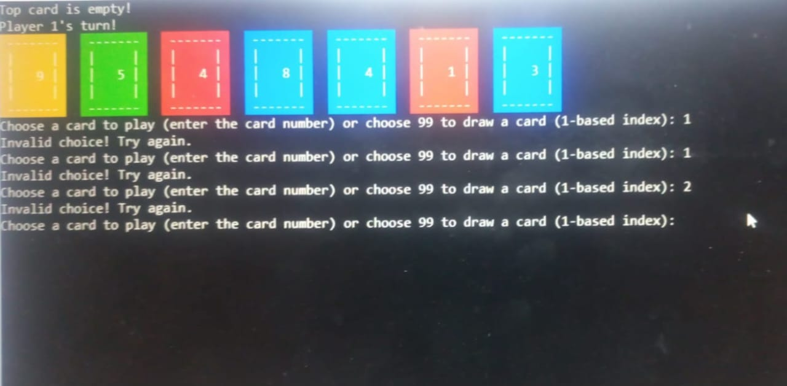

# 🎮 Let's Play UNO! – C++ Console Game

<div align="center">
  <br>
  <b>UNO - 2 Player Console-Based Card Game</b><br>
  <i>Built with C++ | No External Libraries | Text-Based Game</i>
</div>

<p align="center">
  <a href="#about-the-project">About</a> •
  <a href="#key-features">Features</a> •
  <a href="#how-to-use">How to Use</a> •
  <a href="#preview">Preview</a> •
  <a href="#download">Download</a> •
  <a href="#technologies-used">Tech Stack</a> •
  <a href="#stats">Stats</a> •
  <a href="#credits">Credits</a> •
  <a href="#contact">Contact</a>
</p>

---

##  About the Project

A complete **console-based UNO card game** implemented in **C++** for our **Programming Fundamentals** project. Designed for **two players**, the game follows standard UNO rules using arrays, functions, and file handling — no GUI or external libraries used.

> 📝 This project was developed strictly using classroom concepts. No SFML, SDL, or graphics libraries are used. Pure console C++.

---

##  Key Features

- 🃏 **108-Card UNO Deck** – All standard colors and actions  
- 🔁 **Deck Shuffle & Deal** – 2D array-based logic  
- 👥 **2 Player Mode** – Turn-based with real-time updates  
- 🎯 **Card Match Logic** – Matches by number or color  
- 🧠 **Action Cards** – Skip, Reverse, Draw Two, Wild, Wild Draw Four  
- 📣 **UNO Call** – Declare UNO or get penalized  
- 💾 **Save Game History** – Tracks winner, moves, and scores in a file  
- 🎨 **Clean Console UI** – Color output, card layout, hand display  
- 🗂️ **Main Menu** – Options: Play Game, View Scores, Exit  
- 🛑 **Exit Handling** – Confirm before exiting mid-game  

---

##  How to Use

###  Clone or Download the Project

```bash
git clone https://github.com/your-username/uno-cpp-game
cd uno-cpp-game
```

### ⚙️ Compile the Program

```bash
g++ uno.cpp -o uno
```

### ▶️ Run the Game

```bash
./uno     # Linux/Mac
uno.exe   # Windows
```

> 💡 Use `'E'` during gameplay to exit. Press `'Y'` to confirm exit or `'N'` to continue.

---

##  Preview

  


---

##  Download

1. Go to the [GitHub Repo](https://github.com/Salman-ahmed-2/UNO-console-game)
2. Click `Code` → `Download ZIP`
3. Extract the project
4. Compile and run `uno.cpp`

---

##  Technologies Used

  
  
  


---

##  Stats

- 🎮 Games Played: Saved to `history.txt`
- 🏆 Tracks Wins: Player 1 vs Player 2
- 📅 Saves Timestamps & Moves Log

---

##  Credits

- 👨‍💻 Salman Ahmed – `i243004`
- 👨‍💻 Usman Azhar – `i243150`
- 🧠 Instructor: [Programming Fundamentals – FAST NUCES]
- 🔗 Based on official UNO rules
- 🖼 ASCII + color formatting done manually

---

##  Contact

- 📧 Email: [salmanahmed32121@gmail.com](mailto:salmanahmed32121@gmail.com)  
- 💼 LinkedIn: [Salman Ahmed Khan](https://www.linkedin.com/in/salman-ahmed-khan-843240226)  
- 🖥️ GitHub: [Salman Ahmed](https://github.com/salman-ahmed-2)

---

> © 2025 Salman Ahmed Khan & Team — All rights reserved.
